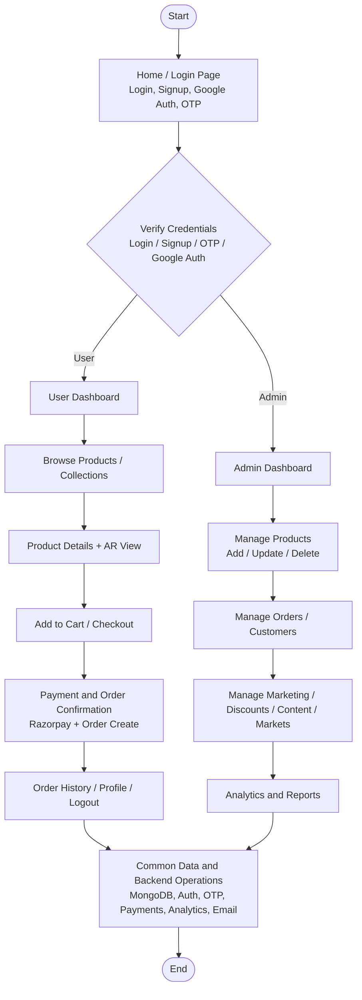

# PROCEDURAL DESIGN - BR FURNITURE E-COMMERCE SYSTEM

```mermaid
flowchart TB

S([Start]) --> H[Home / Login Page<br/>Login, Signup, Google Auth, OTP]
H --> V{Verify Credentials<br/>Login / Signup / OTP / Google Auth}

%% User branch
V -->|User| U1[User Dashboard]
U1 --> U2[Browse Products / Collections]
U2 --> U3[Product Details + AR View]
U3 --> U4[Add to Cart / Checkout]
U4 --> U5[Payment and Order Confirmation<br/>Razorpay + Order Create]
U5 --> U6[Order History / Profile / Logout]

%% Admin branch
V -->|Admin| A1[Admin Dashboard]
A1 --> A2[Manage Products<br/>Add / Update / Delete]
A2 --> A3[Manage Orders / Customers]
A3 --> A4[Manage Marketing / Discounts / Content / Markets]
A4 --> A5[Analytics and Reports]

%% Common backend operations
U6 --> C[Common Data and Backend Operations<br/>MongoDB, Auth, OTP, Payments, Analytics, Email]
A5 --> C

C --> E([End])
```
